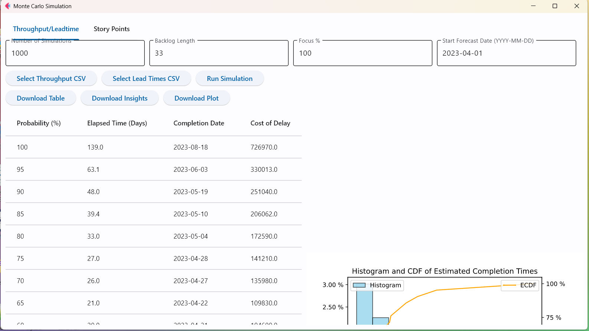
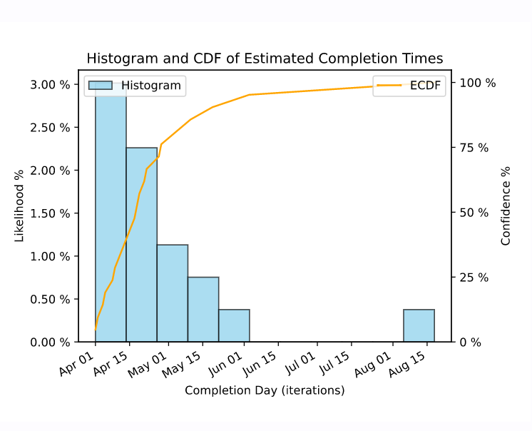

# Monte Carlo Simulation Tool

This tool enables users to run Monte Carlo simulations based on either Throughput/Leadtime data or Story Points data.

## Features

The tool provides two tabs:

1. **Throughput/Leadtime Tab**: Users can input 'Number of Simulations', 'Backlog Length', 'Focus %', and 'Start Forecast Date'. The tool accepts two CSV or Excel files: one for Throughput (which must contain a 'Throughput' column) and one for Leadtime (which must contain a 'Leadtime' column). After running the simulation, the tool generates a forecast table with the columns "Probability %", "Time Elapsed (Days)", "Completion Date", and "Cost of Delay". The tool also plots a histogram and ECDF of the simulation results, and performs a Trend Analysis, Volatility Analysis, and Correlation Analysis of the throughput and leadtime data.

2. **Story Points Tab**: Users can use this tab if they have Story Points data in an Excel file with multiple sheets (each sheet must contain a 'Story Points' column). The functionality of this tab is similar to the Throughput/Leadtime tab, but it runs the Monte Carlo simulation on the 'Story Points' data.

## Getting Started

### Prerequisites

Python 3.7 or higher.
### Installing

Clone the repository:

```bash
git clone https://github.com/DivineCurse/MonteCarlo.git

cd MonteCarlo

## Install Required Packages

pip install -r requirements.txt

## Running the Tool

python main.py
```




